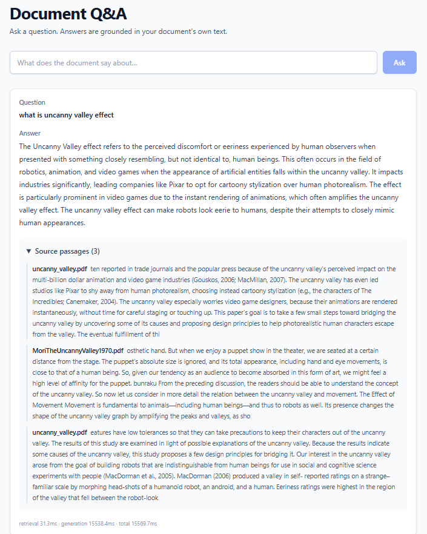

# RAG on Local Documents

A local Retrieval-Augmented Generation (RAG) application for asking questions about a collection of PDF documents.

## RAG Pipeline

The application follows these steps:

1. **Extract** text from each PDF using `pypdf`.
2. **Chunk** the extracted text into 800-character chunks with a 100-character overlap.
3. **Embed** each chunk locally using `sentence-transformers` with `all-MiniLM-L6-v2`.
4. **Store** the embeddings in a local ChromaDB collection.
5. When a question is submitted:
   - The question is embedded using the same embedding model.
   - ChromaDB searches for the most similar chunks across all indexed documents.

6. **Generate** an answer by sending the retrieved chunks and the question to a local LLM through Ollama.
7. Return:
   - the generated answer,
   - the source passages,
   - the source document for each passage,
   - and per-stage latency information.

## Tech Stack

### Backend

- Python
- FastAPI
- `uv` for dependency and environment management
- Ruff
- pypdf
- sentence-transformers
- ChromaDB
- LiteLLM
- Ollama

### Frontend

- React
- TypeScript
- Vite
- Tailwind CSS
- ESLint
- Prettier

## Local Development

### Prerequisites

Install:

- Python 3.12 or 3.13
- `uv`
- Node.js
- npm
- Ollama

### 1. Start Ollama

Install Ollama and pull the model:

```bash
ollama pull phi3
```

Make sure Ollama is running locally.

### 2. Add documents

Place PDF files in:

```text
backend/documents/
```

The backend uses this directory as the document source.

### 3. Backend

Open a terminal in the backend directory:

```bash
cd backend
```

Install/synchronize Python dependencies:

```bash
uv sync
```

Start FastAPI:

```bash
uv run uvicorn app.api:app --reload
```

The API will be available at:

```text
http://127.0.0.1:8000
```

Interactive API documentation:

```text
http://127.0.0.1:8000/docs
```

## Frontend

Open another terminal:

```bash
cd frontend
```

Install dependencies:

```bash
npm install
```

Start the development server:

```bash
npm run dev
```

The frontend will be available at:

```text
http://localhost:5173
```

## Docker

Runs the backend and frontend as production builds in containers. Ollama
itself is **not** containerized - so the image doesn't need to bundle
an LLM runtime, and startup/build stays fast.

### Prerequisites

- Docker and Docker Compose
- Ollama installed and running on your host, with the model pulled:

  ```bash
  ollama pull phi3
  ```

### 1. Add documents

Place PDF files in `backend/documents/` - this
folder is mounted into the backend container as a read-only volume.

### 2. Build and start

From the repository root:

```bash
docker compose up --build
```

This builds two images and starts them:

- **backend** - a multi-stage build that installs the CPU-only build of
  PyTorch and runs `uvicorn` directly, at `http://localhost:8000`.
- **frontend** - a multi-stage build that compiles the app with
  `npm run build` and serves the static output via nginx, at `http://localhost:5173`.

The backend reaches Ollama on your host via `host.docker.internal`, wired
up for both Docker Desktop (Mac/Windows) and Linux via the `extra_hosts`
entry in `docker-compose.yml`. The Chroma index and the downloaded
embedding model are kept in named volumes (`rag_db`, `hf_cache`).

### Stopping

```bash
docker compose down
```

## Git Hooks

The project uses Lefthook to run checks automatically before commits and pushes.

Install the Git hooks:

```bash
npx lefthook install
```

Run the pre-commit checks manually:

```bash
npx lefthook run pre-commit
```

Run the pre-push checks manually:

```bash
npx lefthook run pre-push
```

Pre-commit performs fast checks such as:

```text
Frontend
├── ESLint
└── Prettier

Backend
├── Ruff
└── Ruff format
```

Pre-push performs the complete local validation:

```text
Frontend
├── TypeScript typecheck
├── ESLint
├── Prettier check
└── Production build

Backend
├── Ruff
├── Format check
```

## Example Screenshot


